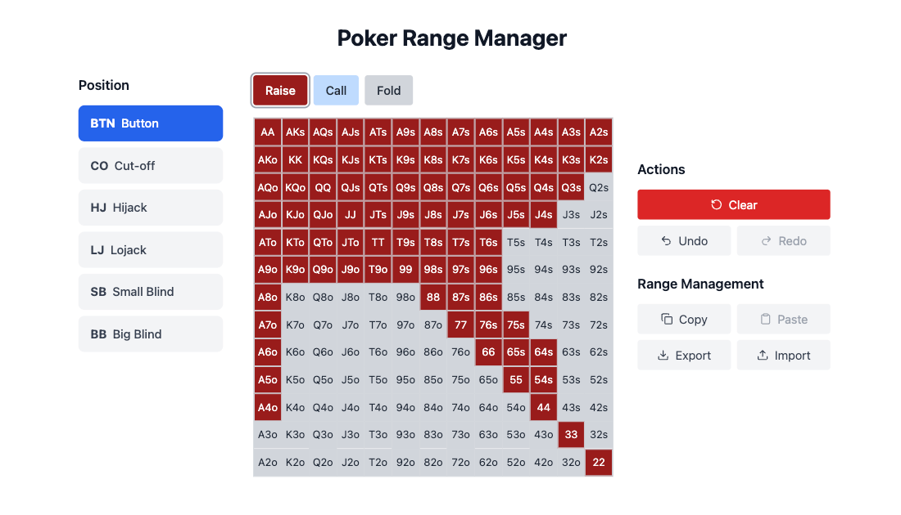
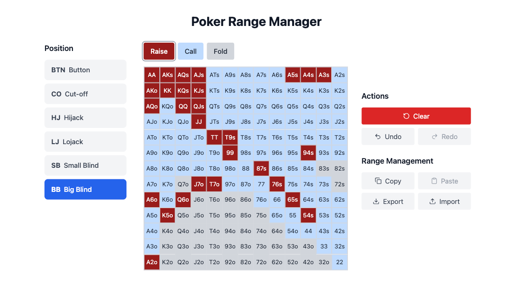
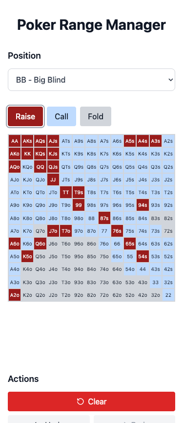

# Poker Range Manager

[](https://poker-range-manager.techgiant.tech)
[](https://poker-range-manager.techgiant.tech)

[](https://reactjs.org/)
[](https://nextjs.org/)

A Next.js-based web application for No Limit Hold'em poker players to create and manage hand ranges. The MVP focuses on RFI (Raise First In) situations from all positions in a 6-max format game, including Big Blind defense ranges.

## Preview

<div align="center">
  
  <br/><br/>
  
  <br/><br/>
  
</div>

## Current Features

- 📊 Interactive hand range grid for RFI situations
- 🎨 Color-coded actions (Raise/Call/Fold)
- 🎯 Position-based ranges (BTN/CO/HJ/LJ/SB/BB)
- 🔄 Undo/Redo functionality
- 📤 Import/Export ranges
- 💾 Local storage persistence
- ⌨️ Keyboard shortcuts

## Future Features

- 📖 Displaying several ranges simultaneaously according to range type (all RFI ranges, etc.)
- 🎲 More complex range situations (facing RFI, 3-bet, etc.)
- 🤹‍♀️ Split ranges (several actions possible for one single hand)
- 📄 Copy pasting ranges in other file formats
- 🔒 Locking ranges to avoid accidental modification
- 🎨 Color theme custumisation
- 🔐 User authentication
- 🌧️ Cloud storage
- 👥 Range sharing capabilities
- 📝 Notes and annotations
- 📊 Advanced statistics

## Tech Stack

- Next.js 15
- React 19
- Tailwind CSS
- Context API

## Quick Start

```bash
git clone https://github.com/JohanPeraldi/poker-range-manager.git
cd poker-range-manager
npm install
npm run dev
```

## Project Structure

```
src/
├── app/
│   ├── favicon.ico
│   ├── globals.css
│   ├── layout.js
│   └── page.js
│
├── components/
│   ├── ActionSelector/
│   ├── ControlPanel/
│   ├── CopyPasteControls/
│   ├── Grid/
│   ├── GridCell/
│   ├── Message/
│   ├── PositionSelector/
│   ├── RangeControls/
│   └── ResetControls/
├── constants/
├── contexts/
├── hooks/
└── utils/
```

## Development Guidelines

### Commit Message Guidelines

We follow the Conventional Commits specification:

```
<type>[optional scope]: <description>

[optional body]

[optional footer(s)]
```

#### Types

- `feat`: New feature
- `fix`: Bug fix
- `docs`: Documentation changes
- `style`: Code style changes
- `refactor`: Code refactoring
- `test`: Adding/fixing tests
- `chore`: Maintenance tasks
- `perf`: Performance improvements

#### Examples:

```bash
# Adding new features
feat: implement hand range grid component
feat(grid): add hover effect on cells

# Fixing issues
fix: correct position selector dropdown alignment
fix(storage): resolve range saving issue

# Documentation changes
docs: update installation instructions
docs(readme): add contributing guidelines

# Code refactoring
refactor: simplify range calculation logic
refactor(grid): optimize cell rendering

# Style changes
style: format grid component code
style(css): adjust color scheme

# Testing
test: add unit tests for range utilities
test(grid): add integration tests for cell selection
```

### Branch Strategy

- `main`: Production-ready code
- Feature branches: `feature/feature-name`
- Bug fixes: `fix/bug-name`

Example branch naming:

```bash
feature/hand-range-grid
feature/position-selector
fix/grid-alignment
fix/local-storage
```

## Contributing

1. Fork the repository
2. Create your feature branch (`git checkout -b feature/amazing-feature`)
3. Commit your changes following our commit message guidelines
4. Push to the branch (`git push origin feature/amazing-feature`)
5. Open a Pull Request

## License

This project is licensed under the MIT License - see the LICENSE file for details.

---

Created by Johan Peraldi
